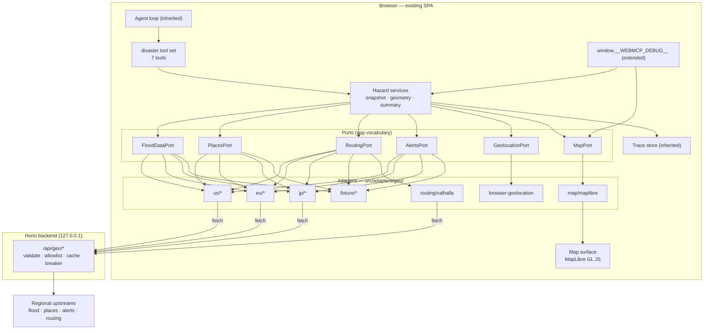

# Design — Disaster Safety Tool Set

- **Status:** Draft
- **Last updated:** 2026-08-29
- **Traces:** [`requirements.md`](./requirements.md) — criteria referenced inline as `R<n>.<m>`
- **Builds on:** [`webmcp-chat/design.md`](../webmcp-chat/design.md) — ports, trace, error model, and
  the Effect runtime are inherited unchanged and are not restated here.

## 1. Design drivers

**Wrongness is the failure mode, not slowness (R8).** Everything else in this playground fails
loudly and locally: a tool throws, a trace event appears, an agent reads it. This feature can fail
*quietly and plausibly* — a scenario hazard map narrated as tonight's forecast, a fixture demo read
as live, an empty result from an uncovered area read as "you're fine". So the design's centre of
gravity is not the map or the routing engine; it is the **provenance envelope** that every datum
carries from the upstream boundary to the sentence the model reads. If a value cannot say where it
came from, when it was issued, and whether anyone was pretending, it does not enter the domain.

**The model reads text; the human reads the map.** WebMCP tool results are content blocks. The map
is a *side effect*, exactly like the `page-control` tool set's theme switch — visible, satisfying,
and structurally secondary. Every tool therefore produces two outputs from one computation: a
budgeted text summary (N4: under 4 KB, for an 8B local model) and a set of map layers whose exact
GeoJSON is readable through the debug handle (R5.5) so an agent can assert on geometry without
screenshots.

**Source churn is the normal case (R6).** Three regions, five kinds of upstream, each with its own
licence, auth, refresh interval, and payload dialect — and all of them free to change. The answer is
the pattern this repo already uses for WebMCP: narrow ports in the app's own vocabulary, one adapter
per upstream, a fixture adapter that is a *peer* rather than a test double, and one shared
conformance suite that defines what a provider is.

**Everything must work with no keys and no network.** That is the state of the development machine
today, and it is also the state of a CI run. Fixture mode is not a degraded path; it is the default
path, with live providers as the configured upgrade.

## 2. Architecture



### 2.1 Layering

The inherited rules hold. Two additions:

| Rule | Why |
| --- | --- |
| Only `src/adapters/geo/**` may name an upstream host, endpoint path, or vendor payload field. | R6.1 — the same discipline as the WebMCP seam, enforced by the same ESLint mechanism (§14.3). |
| Only `src/adapters/map/**` may import `maplibre-gl`, and only `src/lib/geometry/**` may import `@turf/*`. | Keeps two large, opinionated libraries replaceable, and keeps the tool set free of rendering vocabulary. |

### 2.2 Directory layout

```
src/
  domain/
    geo.ts              LonLat, BBox, Radius, Bearing, GeoJSON aliases
    hazard.ts           FloodZone, ZoneKind, HazardClass, DepthBand, HazardSnapshot
    places.ts           SafeFacility, FacilityCategory, RiskState
    routing.ts          EvacuationRoute, RouteStep, Costing, CrossingReport
    alerts.ts           OfficialAlert (CAP-aligned), Severity, Urgency, Certainty
    provenance.ts       Provenance, DataMode, Staleness, Coverage
    geo-errors.ts       the feature's tagged errors (§11)
  ports/
    FloodData.ts  Places.ts  Routing.ts  Alerts.ts  Geolocation.ts  Map.ts
  adapters/
    geo/
      region.ts             region resolution + rules record
      registry.ts           region bundles — the one line a provider adds
      conformance.test.ts   shared suite, parameterised over every provider
      http.ts               backend-proxied fetch + boundary schema decode
      us/  eu/  jp/         one module per upstream
      fixture/              recorded responses; a peer, not a double
      routing/valhalla.ts
      browser-geolocation.ts
    map/maplibre.ts
  lib/geometry/
    circle.ts  clip.ts  simplify.ts  tiles.ts  raster.ts  contour.ts  measure.ts
  app/
    hazard/snapshot.ts      one location → flood + places + alerts, with partials
    hazard/summarise.ts     domain → the budgeted result text
  toolsets/disaster.ts
  ui/map/                   MapPane, Legend, LayerList, AttributionBar, DataModeBanner
server/routes/geo.ts        proxy routes, cache, breaker, allowlist
fixtures/geo/<region>/<source>/<case>.json
```

## 3. Domain model

Host-, vendor-, and region-agnostic. The types that carry the design's weight are `Provenance` and
`ZoneKind`.

```ts
// domain/provenance.ts
export type DataMode = 'live' | 'fixture'

export interface Provenance {
  readonly sourceId: string          // 'jp.gsi.flood-l2', 'us.nws.alerts'
  readonly sourceName: string        // shown to a human, verbatim from the authority
  readonly upstreamUrl: string       // key-redacted, exactly what was called (R9.1)
  readonly datasetVintage?: string   // for scenario data with no issuance time
  readonly issuedAt?: number         // epoch ms, when the authority issued it
  readonly retrievedAt: number       // epoch ms, when we fetched it
  readonly cache: { readonly hit: boolean; readonly ageMs: number }
  readonly licence: string
  readonly attribution: string       // rendered wherever the data is shown (R8.10)
  readonly mode: DataMode            // 'fixture' forces the SIMULATED marker (R8.4)
}

/** Why a result is less than the whole truth. Never silently empty. */
export interface Coverage {
  readonly state: 'full' | 'partial' | 'none'
  readonly reason?: 'tile_cap' | 'no_data_for_area' | 'source_failed' | 'result_cap'
  readonly detail?: string           // "48 of 96 tiles analysed (NE quadrant missing)"
  readonly failedSources: ReadonlyArray<{ sourceId: string; error: string }>
}

export interface Staleness {
  readonly stale: boolean
  readonly ageMs?: number
  readonly expectedRefreshMs?: number
}
```

```ts
// domain/hazard.ts
/**
 * The distinction the whole feature turns on (R2.2). A scenario zone answers
 * "what does the planning map assume could flood here", a forecast zone answers
 * "what is predicted to flood, between these two times". Collapsing them into
 * one "flood zone" type is the single most dangerous simplification available
 * here, so the type system refuses it: `validFrom`/`validTo` exist only on the
 * forecast variant, and the summariser switches on `kind`.
 */
export type ZoneKind =
  | { readonly kind: 'forecast'; readonly validFrom: number; readonly validTo: number }
  | { readonly kind: 'scenario'; readonly designEvent: string }  // "L2 assumed maximum"

export type HazardClass = 'low' | 'moderate' | 'high' | 'extreme' | 'unclassified'

export interface DepthBand {
  readonly minMetres: number
  readonly maxMetres: number | null   // null = "or greater", as sources publish it
}

export interface FloodZone {
  readonly id: string
  readonly kind: ZoneKind
  readonly hazardClass: HazardClass
  readonly depth?: DepthBand
  readonly geometry: Polygon | MultiPolygon
  readonly provenance: Provenance
}

export interface HazardSnapshot {
  readonly location: ResolvedLocation
  readonly radiusKm: number
  readonly zones: ReadonlyArray<FloodZone>
  readonly userInZone: FloodZone | null      // R2.7
  readonly nearest: { zone: FloodZone; metres: number; bearing: Bearing } | null
  readonly coverage: Coverage
  readonly staleness: Staleness
  readonly geometryStats: { featuresIn: number; verticesIn: number; verticesOut: number }
}
```

```ts
// domain/places.ts
export type RiskState = 'clear' | 'at_risk' | 'unknown'   // R3.2 — `unknown` is not `clear`

export interface SafeFacility {
  readonly id: string
  readonly name: string
  readonly category: FacilityCategory   // 'evacuation_shelter' | 'evacuation_site' | 'public_facility' | 'hospital'
  readonly at: LonLat
  readonly metres: number
  readonly bearing: Bearing
  readonly risk: RiskState
  readonly riskDetail?: { hazardClass: HazardClass; depth?: DepthBand }
  readonly provenance: Provenance
}

// domain/routing.ts
export interface EvacuationRoute {
  readonly destination: SafeFacility
  readonly costing: 'pedestrian' | 'bicycle' | 'auto'
  readonly metres: number
  readonly seconds: number
  readonly geometry: LineString
  readonly steps: ReadonlyArray<RouteStep>     // capped, R3.7
  readonly exclusions: 'applied' | 'unavoided' | 'not_requested'   // R3.5
  readonly crossings: CrossingReport            // R3.6
  readonly engine: { name: 'valhalla'; costingNotes: string; dataVintage?: string }
  readonly provenance: Provenance
}

export interface CrossingReport {
  readonly count: number
  readonly firstAtMetres: number | null
  readonly assessed: boolean    // false when there was no flood coverage to assess against
}
```

`OfficialAlert` mirrors CAP fields one-to-one (R4.2) and keeps `headline`, `description`, and
`instruction` as **verbatim strings** with a `language` tag; there is deliberately no `summary`
field, because a field the tool can fill is a field the tool will eventually fill wrongly (R4.6).

## 4. Ports

Six narrow ports. Each is defined by what the tool set needs, not by what any upstream offers.

```ts
// ports/FloodData.ts
export interface FloodDataService {
  readonly sourceId: string
  readonly meta: ProviderMeta                    // vintage, docs URL, licence — R6.7
  readonly zonesWithin: (q: {
    readonly at: LonLat
    readonly radiusKm: number
    readonly horizonHours: number
    readonly signal: AbortSignal
  }) => Effect.Effect<FloodQueryResult, FloodDataUnavailable | UpstreamPayloadInvalid | UpstreamRefused>
}

export interface FloodQueryResult {
  readonly zones: ReadonlyArray<FloodZone>
  readonly coverage: Coverage      // a provider that covered nothing says so — R2.8
  readonly staleness: Staleness
}
```

`PlacesPort.facilitiesWithin` and `AlertsPort.alertsFor` follow the same shape. `RoutingPort.route`
takes origin, destinations, costing, and *optional* exclusion polygons, and returns per-destination
either a route or a tagged reason. `GeolocationPort.current` returns a `ResolvedLocation` carrying
`source: 'geolocation' | 'explicit' | 'pinned'` (R1.7). `MapPort` is a command port —
`setLayer(id, featureCollection, style)`, `focus(bounds)`, `clear()`, `readLayer(id)` — so the tool
set never imports MapLibre, and the debug handle reads layers through the same port (R5.5).

### 4.1 Provider registry and region bundles

```ts
// adapters/geo/registry.ts — the one file a new provider touches (R6.8)
export const BUNDLES: Record<RegionId, RegionBundle> = {
  us: { flood: [usFloodForecast, usFloodScenario], places: [usShelters], alerts: [usAlerts] },
  eu: { flood: [euFloodForecast],                  places: [euFacilities], alerts: [euAlerts] },
  jp: { flood: [jpFloodScenario],                  places: [jpShelters],   alerts: [jpAlerts] },
}
```

A bundle's flood slot is a **list**, because the regions genuinely differ in kind: a region may have
a coarse pan-continental forecast and a fine national scenario map, and both belong in the answer,
labelled (R2.2). Results are merged per source with provenance intact; a source that fails
contributes a `failedSources` entry rather than failing the call (R6.9).

### 4.2 Candidate upstreams

**These are candidates, not commitments.** Endpoints, payload shapes, auth, and above all licence
terms must be confirmed by the source survey (task 1.1) before a provider is written; a source whose
terms this project cannot satisfy does not ship, however good its data.

| Region | Flood | Safe facilities | Alerts | Notes |
| --- | --- | --- | --- | --- |
| `us` | NWS/NWPS river forecasts and flood inundation products (forecast); FEMA National Flood Hazard Layer (scenario) | FEMA/Red Cross open-shelter feeds; OSM as declared fallback | NWS `api.weather.gov` active alerts (CAP-derived) | NWS requires an identifying `User-Agent`; NFHL is explicitly scenario, not forecast |
| `eu` | Copernicus EMS — EFAS/GloFAS river-flood forecasts (coarse); national services as an extension point | National open datasets where licensing permits; OSM fallback | MeteoAlarm CAP feeds, aggregating national meteorological services | Copernicus access needs registration; coverage is pan-European and coarse — say so (R8.5) |
| `jp` | GSI Hazard Map Portal inundation raster tiles (scenario, assumed-maximum) | GSI designated emergency evacuation sites | JMA warnings and advisories | Raster-only flood data drives §7.2; JMA publishes official English, so R4.7 is satisfiable without translation |
| any | — | — | — | `fixture/*` mirrors each of the above from recorded payloads |

Each provider declares `ProviderMeta { sourceId, sourceName, docsUrl, vintage, licence, attribution, expectedRefreshMs }`, displayed in the UI and attached to every datum (R6.7).

### 4.3 Boundary validation

Every upstream payload is decoded with an Effect `Schema` in `adapters/geo/http.ts` before it becomes
a domain value (R6.6). A failure is `UpstreamPayloadInvalid { sourceId, path, expected, excerpt }` —
a shape change names the field that moved, which is the difference between a ten-minute fix and an
afternoon. The raw body is recorded in the trace, truncated with the truncation marked (R9.2).

## 5. Region resolution

`region.ts` resolves `us | eu | jp` from coordinates against coarse bounding polygons, records which
rule matched, and returns `RegionUnsupported` otherwise (R6.3). Two deliberate choices:

- **No nearest-region fallback.** A user in Seoul is not served Japanese shelter data. The error
  names the coordinates, the supported regions, and the fact that no provider was consulted.
- **Resolution is data, not code.** The rules live in one record with a source note per boundary, so
  adding a region is an entry, and an argued-about boundary is a diff.

## 6. The tool set

One selectable set, `disaster`, seven tools. The count is a budget, not an accident: the driving
model is an 8B local model with native tool calls, and every additional tool and every nested schema
field costs accuracy. Schemas are flat, every field is optional except the discriminating one, and
defaults do the work (R1.9, R2.11).

| Tool | Input | Does | Reqs |
| --- | --- | --- | --- |
| `disaster.locate` | — | Resolves and pins the position; returns coordinates, accuracy, source, region | R1.1–R1.8, R6.2 |
| `disaster.flood_forecast` | `latitude?`, `longitude?`, `radiusKm?=20`, `horizonHours?=24` | Flood zones in radius; draws `flood-zones` | R2.* |
| `disaster.find_shelters` | `latitude?`, `longitude?`, `radiusKm?=20`, `limit?=10`, `category?` | Safe facilities with risk state; draws `facilities` | R3.1, R3.2, R3.10 |
| `disaster.evacuation_routes` | `latitude?`, `longitude?`, `radiusKm?=20`, `mode?='walk'`, `limit?=3`, `avoidFlood?=true` | Routes to the best-ranked destinations; draws `routes` | R3.3–R3.9 |
| `disaster.official_alerts` | `latitude?`, `longitude?`, `radiusKm?=20`, `minSeverity?`, `limit?=10` | Alerts in force, verbatim | R4.* |
| `disaster.focus_map` | `target: 'user'\|'floods'\|'facilities'\|'routes'\|'all'` | Re-frames the viewport | R5.3 |
| `disaster.clear_map` | — | Clears every data layer | R5.3 |

`annotations`: every tool is `readOnlyHint: true` — none mutates anything but the map — and
`untrustedContentHint: true` for `official_alerts`, `find_shelters`, and `evacuation_routes`, all of
which carry upstream free text (R4.8, R8.6).

### 6.1 Result text — the contract that carries the safety requirements

Every tool renders through one summariser (`app/hazard/summarise.ts`) with a fixed section order, so
R8.1–R8.5 are structural rather than a habit each tool must remember:

```
FLOOD FORECAST — decision support only. Follow instructions from JMA and your local government.
SIMULATED DATA — NOT REAL (fixture mode)
Source: GSI Hazard Map Portal · scenario map (L2 assumed maximum), vintage 2025-03 · retrieved 04:12Z · cache miss
Location: 35.681, 139.767 (±25 m, geolocation) · radius 20.0 km · region jp
Coverage: PARTIAL — 48 of 96 tiles analysed (tile cap); NE quadrant not assessed
Zones: 14 scenario zones — extreme 2, high 5, moderate 7 · deepest band 5.0-10.0 m
Your position: inside a 'high' zone (depth band 3.0-5.0 m)
Nearest zone edge: 380 m SE
Note: this is a planning hazard map, not a forecast. It shows what an assumed maximum event
would inundate, with no valid time.
Map: layer 'flood-zones' updated (14 polygons, 3 240 vertices after simplification)
```

Five rules the summariser enforces, each tested:

1. **Line 1 names the authority.** Region-specific, from the bundle (R8.2).
2. **Fixture mode is line 2 or it is nowhere** — it is not appended to a footer nobody reads (R8.4).
3. **Coverage precedes content.** A `PARTIAL` or `NONE` coverage line is printed before any zone
   count, so a truncated answer cannot read as a complete one (R8.5).
4. **`NONE` coverage never renders a zone section.** It renders `No flood data covers this location
   from any configured source — this is not a statement that there is no flood risk.` (R2.8)
5. **Verbatim upstream text is fenced** in a delimited block with its language tag and is never
   interleaved with our own prose (R4.6, R8.6).

The whole result is budgeted to 4 KB (N4); the summariser truncates the *list* sections, never the
banner, coverage, or staleness lines, and states what it dropped.

## 7. Spatial pipeline

```mermaid
flowchart LR
    loc["ResolvedLocation"] --> circ["circle(at, radiusKm)<br/>turf.circle, 64 steps"]
    circ --> q{"provider kind"}
    q -->|vector| fetchv["fetch features in bbox"]
    q -->|raster tiles| tilesel["tiles intersecting circle<br/>cap 64 (R2.5)"]
    tilesel --> classify["classify pixels<br/>by published legend"]
    classify --> contour["vectorise (marching squares)"]
    fetchv --> clip
    contour --> clip["turf.intersect with circle"]
    clip --> merge["union per hazard class"]
    merge --> simp["turf.simplify to vertex budget"]
    simp --> stats["measure: area, nearest edge,<br/>point-in-polygon, line crossings"]
    stats --> out["HazardSnapshot"]
```



### 7.1 Turf operations and why each is there

| Step | Turf | Requirement |
| --- | --- | --- |
| Query circle | `circle`, `bbox` | R1.9, and the bbox is what upstreams actually accept |
| Clip to circle | `intersect` | R2.6 — a zone half outside the radius must not inflate the count |
| Merge same-class zones | `union` | R2.6 — overlapping tiles and sources otherwise double-count |
| Simplify | `simplify` (tolerance search) | R2.6, N5, and the routing engine's vertex limit (§8) |
| User in zone | `booleanPointInPolygon` | R2.7 |
| Nearest edge + bearing | `nearestPointOnLine`, `distance`, `bearing` | R2.7 |
| Facility risk | `booleanPointInPolygon` | R3.2 |
| Route crossings | `lineIntersect`, `lineSlice`, `length` | R3.6 |

Simplification is a **budget search**, not a fixed tolerance: start at 1e-5 degrees and double until
the vertex count fits the consumer's budget (20 000 for the map, lower for the routing engine), then
record both counts (R2.6). A fixed tolerance either mangles a small polygon or fails to shrink a
large one, and which happened would be invisible.

Everything in `lib/geometry/` is pure and synchronous, so it is unit-testable with no browser and no
network. Work is chunked to keep any single blocking span under 50 ms (N3).

### 7.2 Raster tile analysis

Japan's national flood data is published as **raster tiles** (colour-coded assumed-maximum
inundation depth), so a vector query is not available and the pipeline must earn its polygons:

1. Compute the slippy-tile range covering the circle at the source's published maximum zoom; cap the
   count at 64 and record the covered fraction if the cap binds (R2.5).
2. Fetch tiles through the backend proxy, draw each to an `OffscreenCanvas`, read pixels.
3. Classify each pixel against the **source's published legend** — a lookup table transcribed from
   the authority's documentation, held in the provider module with a link to the legend page. Nearest
   colour within a tolerance; anything outside it is `unclassified`, never guessed (R8.3).
4. Vectorise each depth class with marching squares, convert tile-pixel coordinates to WGS84, then
   rejoin across tile seams with `union` before clipping.

Two honest limits, recorded in the result and in `tech-debt.md`: classification is only as good as
the legend transcription, and marching squares at tile resolution produces stair-stepped edges of
roughly one pixel (≈1 m at max zoom). Fixtures pin known tiles to expected polygon counts and areas,
so a regression in the classifier is a failing test rather than a subtly wrong map.

## 8. Routing

Valhalla, reached through a hosted provider or a self-hosted instance chosen by configuration
(`ROUTING_BASE_URL`). One request per destination — Valhalla's matrix endpoint would be cheaper but
returns no geometry, and the geometry is what R3.6 needs.

- **Costing** defaults to pedestrian; `walk | bike | car` maps to `pedestrian | bicycle | auto`. The
  engine's assumptions go into the result verbatim (R3.9): the road network does not know about
  closures, damage, or standing water.
- **Exclusions.** Simplified flood polygons are passed as the engine's exclusion areas, respecting
  its documented limits on polygon and vertex count; the simplification budget for routing is
  therefore tighter than for the map. `exclusions: 'applied'`.
- **Fallback (R3.5).** If the engine refuses the request because of the exclusions, or finds no route
  with them applied, retry **once** without them and mark `exclusions: 'unavoided'`. The summariser
  prints `route may cross a flood zone — exclusions could not be applied`. Silently dropping
  exclusions here would produce the most dangerous artefact this feature can make: a confident route
  through water.
- **Crossings (R3.6)** are computed by us, not by the engine, and on the *returned* geometry — so an
  `unavoided` route still reports exactly where it enters a zone.
- **No engine (R3.8).** Unreachable, quota-exhausted, and circuit-open are three distinct errors. The
  fallback is a bearing-and-distance list under the heading `STRAIGHT-LINE DISTANCES — NOT ROUTES.
  Do not navigate by these.`

Destination selection ranks `clear` before `at_risk` before `unknown`, then by distance, and routes
only the top `limit`. `at_risk` destinations are still listed (R3.2) — the user may know something
the data does not.

## 9. Map layers

| Layer id | Source | Style | Notes |
| --- | --- | --- | --- |
| `user-position` | point + accuracy circle | marker + translucent circle | accuracy radius drawn to scale |
| `query-radius` | circle | dashed outline | makes "within 20 km" literal |
| `flood-zones` | polygons | fill by hazard class + hatch pattern per class | pattern satisfies R5.7 |
| `facilities` | points | shape by category, ring by risk state | `at_risk` gets a distinct shape, not only a colour |
| `routes` | lines | width by rank, dashed where `unavoided` | crossings marked with an explicit symbol |

Every layer is individually toggleable (R5.2) and has a text-equivalent list view (R5.8) that is the
same data the model saw. The attribution bar renders every contributing source's required attribution
plus issuance and retrieval times while its layer is visible (R5.4, R8.10).

The basemap is optional by construction (R5.6): with no tile key, MapLibre renders a plain background
style and every data layer still draws, with a stated "no basemap" note. If WebGL is missing, the map
pane is replaced by the list view and the tools are unaffected (R5.9). Camera moves respect
`prefers-reduced-motion` (N7).

## 10. Backend

New routes under `/api/geo/*`, thin in the same sense as the existing LLM proxy: a credential
boundary, a validator, a cache, and a circuit breaker.

| Route | Purpose |
| --- | --- |
| `POST /api/geo/flood` | Region-routed flood query; returns per-source results with provenance |
| `POST /api/geo/places` | Safe facilities in radius |
| `POST /api/geo/alerts` | Alerts in force |
| `POST /api/geo/route` | Valhalla request, with exclusions |
| `GET /api/geo/tiles/:source/:z/:x/:y` | Proxied raster tile, key added server-side |
| `GET /api/geo/providers` | Configured sources, vintages, licences, circuit state, data mode |

Cross-cutting behaviour, all inherited-in-style from the existing backend and applied per source:

- **Allowlist (R7.8).** An outbound host not on the configured allowlist is refused before the
  request is made, logged, and surfaced. This is the one rule that keeps the amended N4 honest.
- **Cache (R7.3).** Keyed on `sourceId + rounded coords + radius + horizon`; TTL per source
  (alerts ~60 s, flood forecasts ~10 min, scenario maps and facilities ~24 h, tiles ~24 h). Every
  response carries `{ hit, ageMs }` into `Provenance`.
- **Retry (R7.5).** Idempotent GETs only, transport failures and 5xx only, at most twice with
  exponential backoff, never on 4xx.
- **Breaker (R7.6).** N consecutive failures opens the circuit for a cooldown; while open, calls fail
  immediately with `SourceCircuitOpen`, which reaches the user as "source unavailable, result is
  partial" rather than as a 30-second stall in every turn.
- **Size cap (R7.10)** on accepted bodies, enforced while reading, not after.
- **Key redaction** in every logged and traced URL.

### 10.1 Configuration

| Variable | Default | Meaning |
| --- | --- | --- |
| `GEO_DATA_MODE` | `fixture` | `live` or `fixture`; `live` with no keys still starts, per-source (R7.7) |
| `GEO_ALLOWED_HOSTS` | *(the documented source hosts)* | Outbound allowlist (R7.8) |
| `ROUTING_BASE_URL` | *(hosted Valhalla)* | Hosted or self-hosted engine |
| `ROUTING_API_KEY` | *(empty)* | Absent ⇒ routing serves fixtures and says so |
| `MAP_TILE_URL` / `MAP_TILE_KEY` | *(empty)* | Absent ⇒ no basemap (R5.6) |
| `GEO_CACHE_TTL_*_MS` | per §10 | Per-source TTLs |
| `GEO_TILE_CAP` | `64` | R2.5 |
| `GEO_TIMEOUT_MS` | `8000` | Per-source request timeout |
| `GEO_BREAKER_THRESHOLD` / `_COOLDOWN_MS` | `5` / `60000` | R7.6 |
| `GEO_COORD_PRECISION` | `4` | Max decimals sent upstream (R1.6) |
| `GEO_TRACE_COORD_PRECISION` | `3` | Decimals recorded in traces (R8.7) |

Parsed by the existing startup config with the same fail-fast behaviour and the same "name the
variable" error (R7.7).

## 11. Error model

New `Data.TaggedError`s, joining the existing flat taxonomy with the same rules — remedy hint,
correlation ids, exhaustive handlers:

| Tag | Raised by | Carries | Remedy shown |
| --- | --- | --- | --- |
| `GeolocationDenied` | geolocation adapter | — | "Allow location access, or pass coordinates" |
| `GeolocationUnavailable` | geolocation adapter | platform message | "Pass coordinates explicitly" |
| `GeolocationTimeout` | geolocation adapter | ms | "Retry, or pass coordinates" |
| `InsecureContext` | geolocation adapter | origin | "Open the page over localhost or https" |
| `RegionUnsupported` | region resolver | coords, supported regions | "Only US, Europe and Japan are covered" |
| `SourceUnavailable` | provider | sourceId, cause | names the source and what is missing |
| `SourceRateLimited` | proxy | sourceId, resetAt? | "Wait until `<resetAt>`; cached data may still serve" |
| `SourceCircuitOpen` | proxy | sourceId, cooldownMs | "Source failing repeatedly; result is partial" |
| `UpstreamPayloadInvalid` | boundary decode | sourceId, path, excerpt | "Upstream shape changed — see the named path" |
| `UpstreamTooLarge` | proxy | sourceId, bytes, cap | "Narrow the radius" |
| `HostNotAllowed` | proxy | host | "Add the host to `GEO_ALLOWED_HOSTS` if intended" |
| `TileAnalysisFailed` | raster pipeline | tile, stage | "Fewer tiles, or a lower zoom" |
| `RoutingUnavailable` | routing adapter | engine, cause | "Straight-line distances only" |
| `RouteNotFound` | routing adapter | destination id | "Try another destination or costing" |
| `NoDataCoverage` | snapshot service | sourceIds tried | **not an error to the model** — see below |

`NoDataCoverage` is modelled as a *value*, not a failure: it flows into `Coverage.state = 'none'` and
is summarised as a first-class answer (R2.8). Making it an error would push it into a catch-all
"something went wrong" path, which is precisely how "no coverage" becomes indistinguishable from "no
risk". Errors are for things that stopped us; absence of data is a finding.

## 12. Observability

New trace event kinds, on the existing envelope (R9.1): `LocationResolved`, `RegionResolved`,
`ProviderCallStarted`, `ProviderCallCompleted` (url redacted, status, bytes, cache hit and age),
`ProviderCallFailed`, `TilesFetched` (count, bytes, cap-bound), `TilesClassified` (per-class pixel
counts), `GeometryComputed` (op, features in/out, vertices in/out, ms), `RoutingRequested`
(exclusions applied or not), `RoutingCompleted`, `CoverageDegraded`, `StalenessDetected`,
`MapLayerUpdated` (layer, feature count, vertex count), `FixtureServed` (source, case name).

Debug handle additions (R9.3): `setLocation({lat, lon})`, `getMapLayers()`, `getLayerGeoJSON(id)`,
`setDataMode('live'|'fixture')`, `listProviders()`, `getCacheStats()`. With these an agent can pin a
location, force fixtures, run a scenario, and assert on the exact drawn geometry with no browser
permissions and no screenshots — the same reproduction loop the project already documents, extended
to a feature whose output is geometric.

Coordinates in traces are redacted to 3 decimals by default (R8.7), including in the `.traces/`
export, with an explicit opt-in for full precision.

## 13. Safety mechanics, in one place

Because these requirements are easy to state and easy to lose, each has exactly one enforcement point:

| Requirement | Enforced at | Test |
| --- | --- | --- |
| Banner, authority, fixture marker, coverage-before-content (R8.1–R8.5) | `summarise.ts`, single code path | Golden-file tests per tool per region, plus a property test that no rendered result lacks a banner |
| Scenario never called a forecast (R2.2) | `ZoneKind` union + summariser switch | Type-level; a test asserts the word "forecast" never appears in scenario output |
| No invention (R8.3) | Providers return only decoded upstream fields; no derived hazard fields exist in the domain | Boundary decode tests; no synthesis code path exists to test |
| Verbatim alert text (R4.6, R4.7) | `OfficialAlert` has no summary/translation field | Fixture round-trip byte equality |
| Untrusted text delimited (R8.6) | Summariser fencing helper | Injection fixture containing instruction-shaped text |
| Coordinate precision (R1.6, R8.7) | One rounding helper at the proxy boundary and one at the trace sink | Tests assert no request or trace carries more decimals |
| Attribution shown (R8.10) | `Provenance` is required on every datum; the attribution bar derives from live layers | Component test: every visible layer contributes an attribution |

## 14. Testing strategy

| Level | Covers |
| --- | --- |
| Unit | Geometry helpers, legend classification, simplification budget search, region resolution, summariser formatting |
| Boundary | Schema decode of every recorded upstream payload, including deliberately mutated payloads that must fail with the right path |
| Conformance | Every provider of every port against one shared suite (R6.5): radius honoured, provenance complete, coverage stated, abort respected, empty result distinguished from failure |
| Service | Cache TTL, retry schedule, breaker transitions, allowlist refusal — on Effect's `TestClock`, no real waiting |
| Tool | Each tool end to end over fixtures: result text golden files per region, layer contents asserted through `MapPort` |
| Scenario | Three region scenarios replayed headlessly: flood → shelters → routes → alerts, with a seeded source failure in one of them |
| Safety | The §13 table, each row asserted; a partial-coverage case and a fixture-mode case must fail the build if their markers disappear |

### 14.1 Fixtures

Recorded from live upstreams by a script (R10.1), keys and precise coordinates redacted on the way
in, committed under `fixtures/geo/<region>/<source>/<case>.json` with the capture time and upstream
URL in the file. Cases per source: a normal result, an empty result, a stale result, a malformed
payload, and an oversized payload. Refreshing a fixture is re-running the script, not editing JSON.

### 14.2 The reference scenario

`jp/tokyo-flood`: a pinned position, a scenario flood map with the position inside a `high` zone, six
facilities of which two are `at_risk`, three routes of which one is `unavoided`, and two JMA alerts
including one whose text contains instruction-shaped prose. It exercises every safety rule in §13 at
once, and it runs in under a second with no network.

### 14.3 Enforcing the new seams

Two ESLint `no-restricted-imports` / `no-restricted-syntax` rules, tested in `tools/lint-rules.test.ts`
the way the existing ones are: `maplibre-gl` only under `src/adapters/map/**`, `@turf/*` only under
`src/lib/geometry/**`, and upstream host literals only under `src/adapters/geo/**`.

## 15. Architecture decision records

**ADR-1 — Fixture providers are peers, not test doubles.**
They ship in production code and are the default data mode. The machine has no keys, CI has no
network, and a demo must never be mistaken for live data — which is only achievable if the fixture
path is first-class and loudly labelled. *Cost:* fixtures must be maintained and refreshed.
*Accepted.* (Mirrors the in-memory adapter decision in the chat spec.)

**ADR-2 — `forecast` and `scenario` are different types, not a field.**
A boolean flag gets ignored; a union forces every consumer to handle both, and makes "narrate the
scenario map as tonight's forecast" a compile error rather than a judgement call. *Cost:* two shapes
to render. *Accepted.*

**ADR-3 — "No coverage" is a value, not an error.**
It flows through `Coverage` into a first-class answer, because routing it into the error channel is
exactly how it becomes indistinguishable from "no risk". *Cost:* every consumer must handle a
non-error empty state explicitly. *Accepted — that is the point.*

**ADR-4 — One summariser, fixed section order.**
Every safety requirement about wording is enforced in one file with golden tests, rather than
repeated in seven tools. *Cost:* less per-tool expressiveness. *Accepted.*

**ADR-5 — Never machine-translate official text.**
A mistranslated instruction is worse than an untranslated one, and the authorities in two of the
three regions publish their own English. The tool returns source language plus any official
translation, and the model may explain — it just cannot launder a translation as official. *Accepted.*

**ADR-6 — Exclusion fallback is labelled, never silent.**
A route computed without flood exclusions is still useful; a route that pretends it avoided the water
is dangerous. *Cost:* a result the model must explain. *Accepted.*

**ADR-7 — Analysis is client-side; the backend is a proxy.**
Turf runs in the page, next to the map and the trace, so one address space holds geometry, drawing,
and the event log — the same reasoning that put the agent loop in the browser. The backend adds only
credentials, allowlist, cache, and breaker. *Cost:* geometry work competes with rendering; mitigated
by chunking (N3). *Accepted.*

**ADR-8 — Raster tiles are vectorised, not merely overlaid.**
An overlay would be cheaper, but then "is this shelter in a flood zone" and "does this route cross
water" are unanswerable, and those are the questions the feature exists for. *Cost:* a classifier and
a contourer to maintain and to be honest about (§7.2). *Accepted.*

**ADR-9 — One request per destination to the routing engine.**
The matrix endpoint is cheaper but geometry-free, and geometry is what crossing detection needs.
*Cost:* N requests, mitigated by cache and a small default `limit`. *Accepted.*

**ADR-10 — Coordinate precision is capped at the boundary, not at the call site.**
One rounding helper at the proxy and one at the trace sink, so a new provider cannot leak precision
by forgetting. *Cost:* routing loses sub-11 m origin accuracy, which is below pedestrian routing's
own resolution anyway. *Accepted.*

## 16. Open questions

1. Should `disaster.evacuation_routes` implicitly call the flood query when no snapshot exists, or
   require the model to call `flood_forecast` first? Implicit is fewer turns for a weak model;
   explicit keeps each tool's cost legible in the trace. Leaning implicit-with-a-stated-note.
2. How should multiple flood sources in one region be presented when they disagree — both, labelled,
   or the finer-grained one with the coarse one as a note? Disagreement is information; hiding it is
   not. Needs a worked example from real US data.
3. Is a 20 km radius the right cap for automobile costing, where 20 km of road is minutes away?
   The requirement fixes it for now; revisit with evidence.
4. Should the tool set refuse to run at all when the region has no configured flood provider, rather
   than returning `Coverage: NONE`? Currently no — an alerts answer is still worth having.
