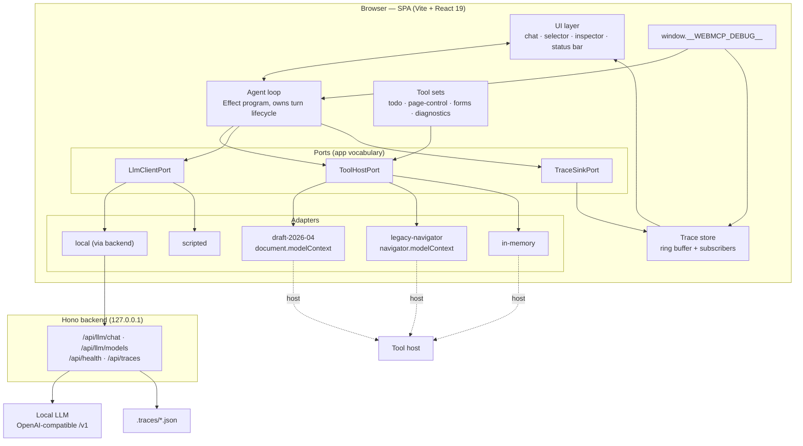
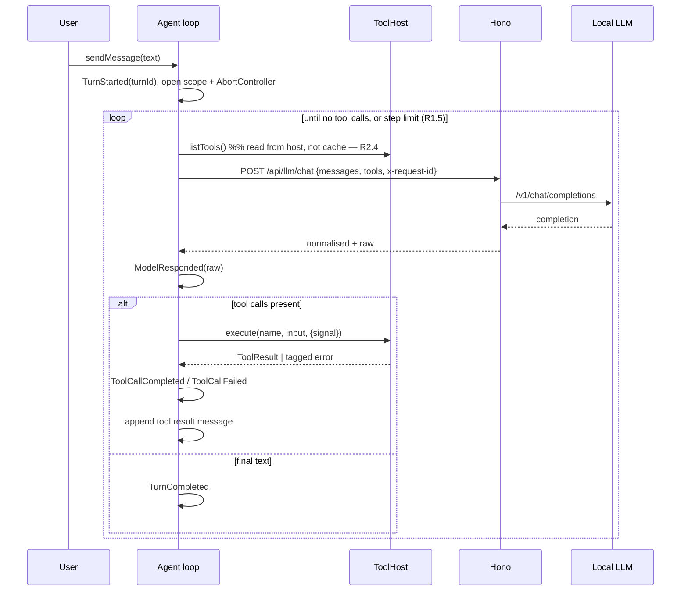

# Design — WebMCP Test Chat Page

- **Status:** Draft
- **Last updated:** 2026-08-29
- **Traces:** [`requirements.md`](./requirements.md) — criteria referenced inline as `R<n>.<m>`
- **Spec baseline:** W3C WebMCP CG Draft Report, 2026-04-23

## 1. Design drivers

Two requirements shape everything else, and they pull in the same direction:

**Debuggability first (R5).** The reader of this system's output is a coding agent, which cannot
squint at a screen or intuit what "it didn't work" means. So the system's internal state is not a
by-product recovered through logging — it is a **first-class data structure**, the trace, that the UI
renders and that can be exported, diffed, and read from disk. Nothing meaningful happens without
producing a typed trace event.

**Spec churn is the normal case (R6).** WebMCP has already moved once: the shape widely documented as
`navigator.modelContext.provideContext(...)` is, in the April 2026 draft, `document.modelContext.registerTool(...)`
with a different tool descriptor and a different return contract. Treating that as an emergency would
be a mistake — it is the steady state. The design answer is a conventional **ports-and-adapters**
boundary, with the unusual discipline that the in-memory adapter is a *peer* of the real ones rather
than a test double, so the whole app is exercisable where the API does not exist at all.

A third, quieter driver: **the loop runs in the browser.** WebMCP tools execute in page context, so
the agent loop must too. The backend is therefore deliberately thin — a credential boundary and a
normaliser, not an orchestrator. This keeps tool execution, the trace, and the UI in one address
space, which is the single largest contributor to debuggability here.

## 2. System architecture



### 2.1 Layering rules

| Layer | May depend on | Must not |
| --- | --- | --- |
| `domain/` | nothing but `effect` | touch DOM, network, React |
| `ports/` | `domain/` | contain implementations |
| `adapters/` | `ports/`, `domain/` | be imported by `domain/` or `ui/` directly |
| `app/` | all of the above | contain JSX |
| `ui/` | `app/`, `domain/` | import from `adapters/` — the one rule that keeps R6.1 true |
| `server/` | `domain/` (shared DTOs only) | import browser code |

`src/adapters/webmcp/**` is the **only** place in the repository permitted to name
`document.modelContext` or `navigator.modelContext`. This is enforced by lint rule, not convention
(§10.3) — R6.1.

### 2.2 Directory layout

```
src/
  domain/
    tool.ts             ToolDefinition, ToolResult, ToolAnnotations
    chat.ts             Message, Turn, TurnState
    trace.ts            TraceEvent union, event constructors
    errors.ts           all tagged errors (§5)
    ids.ts              SessionId, TurnId, CallId branded types
  ports/
    ToolHost.ts         ToolHostPort service tag + interface
    LlmClient.ts        LlmClientPort service tag + interface
    TraceSink.ts        TraceSinkPort service tag + interface
  adapters/
    webmcp/
      detect.ts         capability detection, precedence, rejection reasons
      registry.ts       adapter catalogue (the one line a new adapter adds)
      draft-2026-04.ts  document.modelContext.registerTool
      legacy-navigator.ts
      in-memory.ts
      conformance.test.ts   shared suite, runs against every adapter
    llm/
      local.ts          talks to backend, OpenAI-compatible normalisation
      scripted.ts       deterministic; scenarios in scripted-scenarios.ts
      tool-call.ts      native vs prompted strategies + parser
    trace/
      memory-sink.ts
      server-sink.ts
  toolsets/
    todo.ts  page-control.ts  forms.ts  diagnostics.ts  index.ts
  app/
    runtime.ts          Layer composition, ManagedRuntime
    agent-loop.ts       the turn program
    session.ts          session state store
    debug-handle.ts     window.__WEBMCP_DEBUG__
    config.ts           client config from URL + defaults
  ui/
    App.tsx  chat/  selector/  inspector/  status/  common/
    hooks/useRun.ts     the single Effect→React boundary
server/
  index.ts  routes/  config.ts  logger.ts
docs/specs/webmcp-chat/
```

## 3. Domain model

Deliberately small and host-agnostic. These types survive every WebMCP revision.

```ts
// domain/tool.ts
export interface ToolDefinition<A = unknown> {
  readonly name: string                    // ^[A-Za-z0-9_.-]{1,128}$ per spec
  readonly title?: string
  readonly description: string             // required, non-empty
  readonly inputSchema: Schema.Schema<A>   // single source of truth — R3.5
  readonly annotations: ToolAnnotations
  readonly execute: (input: A, ctx: ToolContext) => Effect.Effect<ToolResult, ToolExecutionError>
}

export interface ToolAnnotations {
  readonly readOnlyHint: boolean
  readonly untrustedContentHint: boolean
}

export interface ToolContext {
  readonly signal: AbortSignal
  readonly callId: CallId
  readonly turnId: TurnId
}

/** Content-block shape, mirroring MCP. Adapters stringify as their host requires. */
export type ToolResult = {
  readonly content: ReadonlyArray<{ readonly type: "text"; readonly text: string }>
  readonly isError?: boolean
}

export interface ToolSet {
  readonly id: string
  readonly title: string
  readonly description: string
  readonly tools: ReadonlyArray<ToolDefinition<any>>
}
```

`inputSchema` is an Effect `Schema`, not a hand-written JSON Schema. Validation and publication both
derive from it — `Schema.decodeUnknown` for R3.6, `JSONSchema.make` for R2.7 — so the two can never
drift (R3.5).

### 3.1 Why the result shape is ours, not the host's

The April draft's `executeTool()` resolves to a `DOMString` — "the stringified result" — while the
README's `execute` callback returns `{ content: [{ type: "text", text }] }`. That inconsistency is
exactly the kind of thing that will be resolved one way or another in a later revision. The domain
holds the richer content-block form; each adapter is responsible for whatever flattening or parsing
its host demands, and for recording the raw host value in the trace so the mismatch stays visible
(R6.8).

## 4. Ports and adapters

### 4.1 `ToolHostPort`

The whole WebMCP surface, reduced to what this application actually needs:

```ts
// ports/ToolHost.ts
export class ToolHost extends Context.Tag("app/ToolHost")<ToolHost, {
  readonly id: AdapterId
  readonly specRevision: SpecRevision        // R6.7

  readonly register: (
    tool: ToolDefinition<any>
  ) => Effect.Effect<RegistrationHandle, ToolRegistrationError>

  /** Read back from the host, never from local state — R2.4 */
  readonly listTools: () => Effect.Effect<ReadonlyArray<HostTool>, ToolHostUnavailableError>

  readonly execute: (
    name: string,
    input: unknown,
    options: { readonly signal: AbortSignal }
  ) => Effect.Effect<ToolResult, ToolNotFoundError | ToolInputInvalidError | ToolExecutionError | ToolTimeoutError | ToolAbortedError>

  /** Host-driven tool-set changes (R2.5), scoped to the consumer fiber. */
  readonly changes: Stream.Stream<void>
}>() {}

export interface RegistrationHandle {
  readonly unregister: Effect.Effect<void>   // Scope-managed; see §4.4
}
```

Note what is *absent*: no `AbortSignal` on registration, no `exposedTo`, no `Window`, no permissions
policy. Those are host details. When the spec adds or renames them, the port does not move.

### 4.2 Adapter catalogue

| Id | Target | Registration | Detection predicate |
| --- | --- | --- | --- |
| `draft-2026-04` | `document.modelContext` | `registerTool(tool, { signal })`, tools listed via `getTools()`, invoked via `executeTool()` | `"modelContext" in document && typeof document.modelContext.registerTool === "function"` |
| `legacy-navigator` | `navigator.modelContext` | `provideContext({ tools })` — whole-set replacement, no per-tool handle | `"modelContext" in navigator && typeof navigator.modelContext.provideContext === "function"` |
| `in-memory` | none | plain `Map`, own event emitter | always true |

Precedence is `draft-2026-04` → `legacy-navigator` → `in-memory`, overridable via `?adapter=` (R6.4).
Detection records **why each candidate was rejected**, not merely which one won (R6.3) — the
difference between "no WebMCP" and "WebMCP present but `registerTool` missing" is the whole diagnosis.

The `legacy-navigator` adapter is not dead weight: it is the proof that the seam works. An adapter
whose host replaces the entire tool set on every change, and which has no per-tool unregister,
stresses the port far harder than the current draft does. If `ToolHostPort` can express both, it can
probably express the next revision too (R6.6).

### 4.3 Adapter sketch — `draft-2026-04`

```ts
export const makeDraft202604 = Effect.gen(function* () {
  const trace = yield* TraceSink
  const mc = document.modelContext   // the only file allowed to say this

  const register = (tool: ToolDefinition<any>) =>
    Effect.gen(function* () {
      const controller = new AbortController()
      const jsonSchema = JSONSchema.make(tool.inputSchema)

      yield* Effect.tryPromise({
        try: () => mc.registerTool({
          name: tool.name,
          title: tool.title,
          description: tool.description,
          inputSchema: jsonSchema,
          annotations: tool.annotations,
          execute: (raw, opts) => runToolFromHost(tool, raw, opts.signal),
        }, { signal: controller.signal }),
        // Host's own error is preserved verbatim — R6.8
        catch: (cause) => new ToolRegistrationError({ tool: tool.name, adapter: "draft-2026-04", cause }),
      })

      yield* trace.emit(TraceEvent.ToolRegistered({ tool: tool.name, adapter: "draft-2026-04", jsonSchema }))
      return { unregister: Effect.sync(() => controller.abort()) }
    })
  // …listTools via mc.getTools(), execute via mc.executeTool(), changes from "toolchange"
})
```

Execution is shared across adapters through a fourth port, `ToolRunner` (`src/ports/ToolRunner.ts`,
implemented in `src/app/tool-runner.ts`): it decodes input against the schema (R3.6), opens a span,
applies the fault injector (R5.10), enforces the per-call timeout, races the abort signal, emits
`ToolCallStarted` / `ToolCallCompleted` / `ToolCallFailed`, and converts the Effect back into the
promise the host wants. That is why an adapter is ~150 lines rather than ~400, and why all of them
behave identically under the conformance suite.

Structured errors cross a boundary that speaks promises and strings. `ToolBoundaryError` remains a
rejection for hosts that preserve it. For a host that flattens every rejection to an opaque
`DOMException`, the draft adapter fulfils a versioned, JSON-safe `isError` result instead and decodes
it when `executeTool()` returns. The original typed error is therefore restored; an unrelated host
rejection still becomes `ToolExecutionError` with the host's verbatim message.

### 4.4 Lifecycle

Registrations are `Scope`d. Enabling a tool set opens a scope; disabling it, switching adapters, or
resetting the session closes it, and every registration handle unregisters in reverse order —
including on failure and interruption (R7.7, R2.3). No manual cleanup bookkeeping, and no orphaned
tools surviving an adapter switch.

### 4.5 `LlmClientPort`

```ts
export class LlmClient extends Context.Tag("app/LlmClient")<LlmClient, {
  readonly id: DriverId                       // "local" | "scripted"
  readonly listModels: () => Effect.Effect<ReadonlyArray<ModelInfo>, LlmTransportError>
  readonly complete: (
    req: CompletionRequest
  ) => Effect.Effect<CompletionResponse, LlmTransportError | LlmProtocolError | LlmTimeoutError>
}>() {}

export interface CompletionRequest {
  readonly model: string
  readonly messages: ReadonlyArray<ChatMessage>
  readonly tools: ReadonlyArray<PublishedTool>   // name + description + JSON Schema
  readonly strategy: "native" | "prompted"       // R4.5
  readonly signal: AbortSignal
  readonly requestId: RequestId
}

export interface CompletionResponse {
  readonly text: string | null
  readonly toolCalls: ReadonlyArray<{ id: string; name: string; input: unknown }>
  readonly raw: unknown            // verbatim upstream JSON — R5.3
  readonly requestId: RequestId
}
```

`raw` is carried all the way to the inspector on purpose. A normalised view that hides the wire
format is precisely what makes local-model debugging miserable.

### 4.6 Tool-call strategies

`native` sends the `tools` parameter and reads `choices[0].message.tool_calls`. `prompted` appends a
system instruction describing each tool and asking for a single fenced JSON object, then parses the
reply with a tolerant extractor (fenced block → first balanced `{…}` → give up). On failure the text
is treated as a final answer and a `ToolCallParseFailed` event is recorded (R4.6) — a parse failure
is a finding, not an error, because the model may simply have chosen to answer directly.

The strategy is a runtime setting rather than a per-model lookup table. Which local models handle
native tool calls well is exactly the question this playground exists to answer; hard-coding an
opinion would defeat it.

One case deserves its own error rather than a generic transport failure. Ollama and llama.cpp reject
a request carrying `tools` when the model's template has no tool support, with a message naming the
model. That is the single most common reason a local model appears to ignore every tool, and it is a
configuration answer, not a fault — so `ModelLacksToolSupport` carries the one remedy that helps:
switch to the prompted strategy. The backend returns it as `400`, because the upstream is healthy and
it is the request that must change.

## 5. Error model

One flat, exhaustive taxonomy in `domain/errors.ts`, all `Data.TaggedError` (R7.2):

| Tag | Raised by | Carries | Remedy hint shown |
| --- | --- | --- | --- |
| `AdapterUnsupported` | detection | candidate, reason | "Force the in-memory adapter" |
| `ToolRegistrationError` | adapter | tool, adapter, host cause | host message verbatim |
| `DuplicateToolName` | selector | tool, owning sets | "Disable one of the sets" |
| `ToolNotFound` | host | name, known names | — |
| `ToolInputInvalid` | validation | ParseIssue paths | rendered as a path list |
| `ToolExecutionError` | tool body | tool, cause | — |
| `ToolTimeout` | runner | tool, ms | "Raise the per-call timeout" |
| `ToolAborted` | runner | tool | — |
| `ToolHostUnavailable` | adapter | adapter | "Reload, or force in-memory" |
| `LlmTransportError` | driver | url, status?, cause | "Is the endpoint running?" — R4.9 |
| `ModelLacksToolSupport` | upstream | model, host message | "Switch the strategy to prompted" — R4.5 |
| `LlmProtocolError` | driver | body excerpt | "Model returned unparseable JSON" |
| `LlmTimeout` | driver | ms | "Raise the timeout or use a smaller model" |
| `StepLimitExceeded` | loop | turnId, limit | "Raise max steps" — R1.5 |
| `ConfigError` | startup | variable, value | precise variable name — R8.5 |

Three rules keep this honest:

1. **Typed channel for expected failures; defects stay defects (R7.3).** A tool body that throws
   produces a defect, surfaced in a loud red inspector state distinct from ordinary tool failure —
   because "the tool reported an error" and "the tool is broken" need different fixes.
2. **Every error carries its correlation ids**, so any UI error can be traced to its events (R5.13).
3. **Handlers are exhaustive** via `Effect.catchTags`; a new tag is a type error at every handler,
   which is the point.

### 5.1 Logging and tracing

A custom `Logger` fans out to console and trace store, so one `Effect.log*` call reaches both (R7.5).
Spans (`Effect.withSpan`) wrap each turn, model call, and tool call; the inspector reads span
timings directly (R7.4), which is why durations need no separate instrumentation.

Trace events are a discriminated union (`domain/trace.ts`) with a common envelope:

```ts
interface TraceEnvelope {
  readonly seq: number              // monotonic, per session
  readonly at: number               // epoch ms
  readonly sessionId: SessionId
  readonly turnId?: TurnId
  readonly callId?: CallId
  readonly requestId?: RequestId    // joins to backend logs — R5.8
  readonly durationMs?: number
}
```

Event kinds: `SessionStarted`, `AdapterDetected`, `AdapterSelected`, `ToolSetEnabled`,
`ToolSetDisabled`, `ToolRegistered`, `ToolRegistrationFailed`, `ToolsListed`, `ToolChanged`,
`TurnStarted`, `ModelRequested`, `ModelResponded`, `ToolCallParseFailed`, `EmptyResponseRetried`,
`ToolCallStarted`, `ToolCallCompleted`, `ToolCallFailed`, `TurnCompleted`, `TurnFailed`,
`TurnCancelled`, `FaultInjected`, `LogRecord`, `Defect`.

Storage is a bounded ring buffer of 5 000 with a discard marker (N2). The inspector virtualises all
matching events: its rows are measured because their expandable content has variable height, and
only the viewport plus a small overscan is mounted. Every retained event remains reachable by
scrolling without making the panel sluggish.

## 6. The agent loop



Design points worth stating:

- **Tools are re-listed from the host each step**, not cached. Slower by microseconds, and it means
  a tool set toggled mid-turn behaves correctly and the trace shows exactly what the model was
  offered at each step (R2.4, R5.3).
- **Tool failures are fed back to the model as tool results**, not raised. `isError: true` plus the
  error message lets the model recover, and mirrors how real agents behave. Only host-level failures
  (`ToolHostUnavailable`) abort the turn.
- **One `AbortController` per turn**, passed to both the model request and every tool call, so cancel
  is a single call (R1.3) and interruption unwinds the scope cleanly (R7.7).
- **The step limit is a guard, not an error condition** — the transcript renders in full, flagged
  (R1.5).

## 7. UI

```
┌──────────────────────────────────────────────────────────────────────────────┐
│ status bar: adapter draft-2026-04 (rev 2026-04-23) · driver scripted ·        │
│             model — · backend ✓ · tools 12 · idle          [reset] [export]   │  R5.12
├───────────────────┬──────────────────────────────┬───────────────────────────┤
│ WebMCP selector   │ Chat transcript              │ Inspector                 │
│                   │                              │                           │
│ ☑ todo        (4) │ user  add milk to my list    │ [all|model|tool|error]    │
│ ☑ diagnostics (5) │ ▸ tool add-todo    12ms  ✓   │ #41 ModelRequested   3ms  │
│ ☐ page-control(3) │   {"text":"milk"}            │ #42 ToolCallStarted       │
│ ☐ forms       (4) │ asst  Added "milk".          │ #43 ToolCallCompleted     │
│                   │                              │     ▾ raw JSON  [copy]    │
│ adapter  [▾]      │ ┌──────────────────────────┐ │ #44 ModelResponded  810ms │
│ driver   [▾]      │ │ message…          [send] │ │                           │
│ model    [▾]      │ └──────────────────────────┘ │ [copy turn] [copy all]    │
│ inject fault [▾]  │                              │                           │
└───────────────────┴──────────────────────────────┴───────────────────────────┘
```

Three panes, all visible at once, because the debugging question is always "what did the model see,
what did the tool do, and what came back" — answering it should never require navigation. The
inspector is a peer of the chat, not a drawer behind it (R5.2).

Every interactive element carries `data-testid="<area>-<element>-<qualifier>"`, e.g.
`selector-toolset-toggle-todo`, `chat-input-message`, `inspector-event-43` (R5.11).

### 7.1 Effect → React boundary

Exactly one hook, `useRun`, bridges `ManagedRuntime` to components; components never see an `Effect`.
State lives in stores exposed through `useSyncExternalStore`, so React 19's compiler and concurrent
rendering are not fighting a subscription layer. This confines Effect's learning cost to `app/` and
`adapters/`, as the risk register requires.

### 7.2 Styling

Tailwind v4 via `@tailwindcss/vite` — CSS-first config, no `tailwind.config.js`. Design tokens as CSS
custom properties in `@theme`, with a `dark:` variant driven by the `page-control` tool set's theme
tool, which makes that tool visibly do something (R3.2).

## 8. Backend (Hono)

Thin by design: a credential boundary (R4.2), a normaliser, and a disk sink.

| Route | Purpose | Notes |
| --- | --- | --- |
| `POST /api/llm/chat` | Proxy to upstream `/v1/chat/completions` | Body validated (R8.3); returns `{ normalised, raw, requestId }` |
| `GET /api/llm/models` | Upstream `/v1/models` | Empty list, not 500, when upstream is down |
| `GET /api/health` | Liveness + upstream reachability | **Always 200** (R8.2) — a health check that fails when the thing it reports on is down tells you nothing |
| `POST /api/traces` | Write `.traces/<sessionId>.json` | `sessionId` must match `^[A-Za-z0-9_-]{1,64}$`; path resolved and confirmed inside `.traces/` (R8.7) |

`x-request-id` is generated by the client, echoed in responses, and included in every backend log
line, so client trace and server log join on one key (R5.8, R8.4). It binds to `127.0.0.1` by
default; production must explicitly set `HOST`, while CORS remains limited to the dev origins
(R8.6). Production responses opt into the WebMCP `tools` permissions-policy feature and carry the
configured Chrome Origin Trial token without baking origin-specific metadata into the SPA.

In development, `@hono/vite-dev-server` runs the backend inside the Vite process: one command, one
log stream, HMR on both sides (R9.1). In production `bun run build` emits the SPA and the backend
serves it statically.

### 8.1 Configuration

| Variable | Default | Meaning |
| --- | --- | --- |
| `LLM_BASE_URL` | `http://localhost:11434/v1` | OpenAI-compatible endpoint (R4.1) |
| `LLM_API_KEY` | *(empty)* | Sent as bearer when set; some local servers require any value |
| `LLM_DEFAULT_MODEL` | *(empty)* | Falls back to first model reported by upstream |
| `LLM_TIMEOUT_MS` | `120000` | R4.8 |
| `HOST` | `127.0.0.1` | Bind interface; use `0.0.0.0` explicitly in a production container |
| `PORT` | `8787` | Backend port |
| `WEBMCP_ORIGIN_TRIAL_TOKEN` | *(empty)* | Public token issued for the exact production HTTPS origin |
| `TRACE_DIR` | `.traces` | R5.6 |
| `TRACE_WRITE_ENABLED` | `true` in dev | R8.7 |

Parsed once at startup through an Effect `Schema`; a malformed value fails fast with the variable
name (R8.5). `.env` is git-ignored (N5).

## 9. Debug surface for coding agents

The feature that most directly serves the top-priority requirement. `window.__WEBMCP_DEBUG__`
(R5.9) lets an agent drive the page over CDP or a devtools console with no UI simulation:

```ts
interface WebMcpDebugHandle {
  getTrace(filter?: { kinds?: string[]; turnId?: string }): TraceEvent[]
  getTools(): HostTool[]                  // read from the host
  getAdapter(): { id: string; specRevision: string; detection: DetectionReport }
  callTool(name: string, input: unknown): Promise<ToolResult>   // bypasses the model entirely
  setToolSets(ids: string[]): Promise<void>
  setDriver(id: "local" | "scripted"): Promise<void>
  sendMessage(text: string): Promise<TurnSummary>
  injectFault(spec: { kind: "fail" | "hang" | "invalid"; count: number }): void
  waitForIdle(timeoutMs?: number): Promise<void>
  exportTrace(): TraceExport
  saveTrace(): Promise<{ path: string }>
  reset(): void
}
```

`callTool` matters more than it looks: it separates "the tool is broken" from "the model called the
tool wrong", which is the most common ambiguity in agent debugging and normally costs an hour.

The documented reproduction loop (R9.4) is: `bun run dev` → drive via the handle → `saveTrace()` →
read `.traces/<id>.json`. No screenshots, no scraping — a coding agent gets a complete, ordered,
typed account of what happened.

## 10. Testing strategy

Tests live beside the code they cover. The one exception is the request-id join test, which sits in
`server/` because it imports the Hono app; keeping it in the client project would drag server code
into a DOM-only TypeScript project.

| Level | Tool | Covers |
| --- | --- | --- |
| Unit | Vitest | Schema derivation, prompted-call parser, error mapping, trace reducer |
| Conformance | Vitest, shared suite | Every `ToolHostPort` adapter against identical assertions (R6.5) |
| Service | Vitest + Effect `TestClock` | Timeout, retry/backoff, cancellation without real waiting (R4.8) |
| Component | Vitest + Testing Library | Selector, transcript, inspector filtering |
| Loop | Vitest, scripted driver + in-memory host | Multi-step turns, tool failure recovery, step limit — fully deterministic |

The conformance suite is the load-bearing piece for R6. It is written against the port and
parameterised over the adapter catalogue, so a new adapter is proven equivalent before it can be
selected. Adapters targeting an API the test browser lacks are skipped with an explicit reason
printed, never silently.

### 10.3 Enforcing the seam

An ESLint `no-restricted-syntax` rule bans `document.modelContext` / `navigator.modelContext` outside
`src/adapters/webmcp/**`. R6.1 is otherwise a promise that erodes on the first deadline.

## 11. Architecture decision records

**ADR-1 — Agent loop runs in the browser.**
WebMCP tools execute in page context, so a server-side loop would need a round trip per tool call and
would split the trace across two processes. Loop, tools, and trace stay in one address space; the
backend keeps only the credential boundary. *Cost:* no server-side conversation persistence.
*Accepted.*

**ADR-2 — In-memory adapter is a peer, not a test double.**
Ships in production code and can be selected at runtime. Makes the app fully exercisable in browsers
without WebMCP, gives the conformance suite a reference implementation, and provides a known-good
control when a real adapter misbehaves. *Cost:* one more adapter to maintain. *Accepted.*

**ADR-3 — Effect `Schema` as the single tool-input declaration.**
Runtime validation and published JSON Schema derive from one declaration (R3.5), so they cannot
drift. *Cost:* JSON Schema output is Effect's dialect; a model that dislikes it needs a mapping layer.
*Accepted.*

**ADR-4 — Non-streaming responses first.**
A whole response is one trace event with verbatim JSON; a stream is dozens of partial ones, and
inspecting a half-parsed tool call is materially harder. Local models on localhost make latency
tolerable. Streaming is deferred, and the `CompletionResponse` shape does not preclude it.
*Accepted.*

**ADR-5 — Ship the superseded `navigator.modelContext` adapter.**
Not for compatibility — for pressure. An adapter with whole-set replacement semantics and no per-tool
unregister proves `ToolHostPort` is not shaped around one draft (R6.6). *Cost:* maintaining an
adapter no current browser needs. *Accepted.*

**ADR-6 — Health check always returns 200.**
It reports upstream reachability in its body instead. A 503 when the LLM is down is indistinguishable
from a dead backend, which is the opposite of diagnostic. *Accepted.*

**ADR-7 — Tool failures return to the model; host failures abort.**
Matches real agent behaviour and exercises recovery paths. *Cost:* a persistently failing tool can
consume steps — bounded by the step limit. *Accepted.*

## 12. Open questions

1. Should the prompted-strategy system prompt be user-editable in the UI? It is the main lever for
   making a weak local model usable, which argues yes; it also makes traces harder to compare.
2. Does the next WebMCP revision keep `executeTool()` returning a stringified result, or move to
   content blocks? Affects only §3.1's flattening, by design.
3. Whether to record token counts — most local endpoints report `usage`, but not all.


## 13. Implementation notes

Deviations from this design as built, all recorded above in place:

- Tool execution is a fourth port, `ToolRunner`, rather than a bare shared helper (§4.3).
- `ToolsListed` carries a `source` discriminator (§5.1).
- The inspector virtualises its variable-height rows (§5.1, §7).

The lint rules behind R6.1 and R7.1 are themselves tested in `tools/lint-rules.test.ts`. Writing that
test found a real config bug: an ESLint config object *replaces* a rule's options rather than merging
them, so the `src/app/**` no-`throw` block had been silently dropping the host-global ban for that
directory. Both blocks now state their full selector list.
